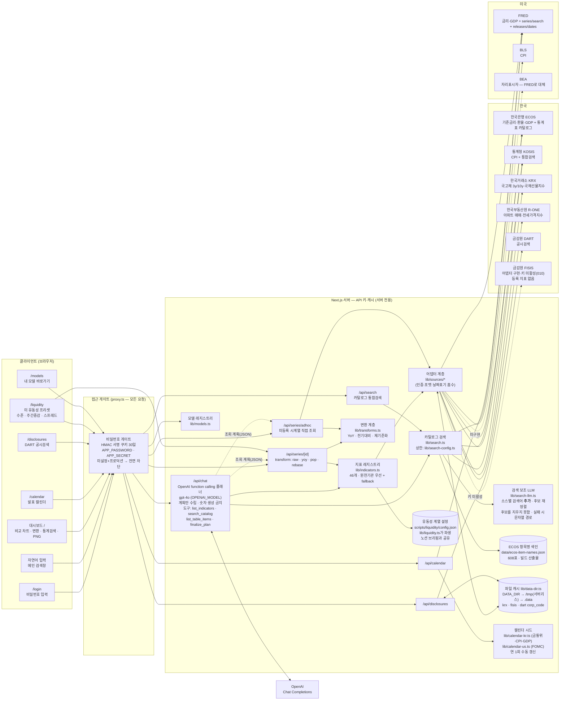

# 아키텍처

최종 갱신: 2026-08-02 (구현 상태 기준) · 배포: <https://econ-cockpit.vercel.app>

## 라우트

| 경로 | 역할 |
|---|---|
| `/` | 자연어 입력 + 지표 선택·통계검색 + 비교 차트 (변환·차트유형·PNG) |
| `/calendar` | 한·미 발표 캘린더 |
| `/disclosures` | DART 공시검색 |
| `/liquidity` | 미 유동성 프리셋 — ①지준·ON RRP·TGA 수준(기본 3년) ②지준 주간 증감(기본 1년) ③SOFR−IORB 스프레드(기본 1년). 구성·문안은 `scripts/liquidity/config.json`에서 파생 |
| `/models` | 내가 만든 모델·앱 바로가기 |
| `/login` | 비밀번호 게이트 진입점 (게이트 예외) |
| `/api/indicators` · `/api/series/[id]` · `/api/series/adhoc` · `/api/search` · `/api/chat` · `/api/calendar` · `/api/disclosures` | 데이터 API (게이트 적용) |
| `/api/login` · `/api/logout` | 세션 쿠키 발급·삭제 (게이트 예외 — 자체 검증) |

## 원칙

- **순수 소비자**: 계산·추정 로직 없음. 나우캐스팅 결과가 필요하면 기존 엔진(GDP/CPI) API만 호출.
- **키는 서버에서만**: 모든 기관 키·OpenAI 키는 환경변수 → 서버 라우트/어댑터. 클라이언트에는 절대 미노출.
- **모델은 계획만**: 챗봇은 조회 계획(JSON)을 만들 뿐, 수치는 반드시 어댑터가 조회한 실데이터를 쓴다.
  검색 보조 LLM(`lib/search-llm.ts`)도 마찬가지로 **검색어와 후보 순서만** 다루고 값은 만들지 않으며,
  실패하면 문자열 매칭으로 폴백해 LLM이 꺼져도 기능이 유지된다.
- **상한은 한곳에, "무엇을 자르는지"와 함께**: 검색 상한은 `lib/search-config.ts`, 차트 계열 상한은
  `lib/chart-config.ts`. 상한을 코드에 흩어 놓으면 무엇이 잘려 사라졌는지 아무도 모른다
  (608표 전수 실측 2026-08-05: 착수 전 표의 **88.7%**에서 항목이 잘렸고 조합 1,056,975개 중
  노출 5,008개 = **0.47%**. 상한 인상 후 69.1% / 11,234개 = **1.06%**).
- **상한 인상은 해결이 아니다**: 표당 상한 × 표 수가 산술 천장이라 어떤 값을 넣어도 몇 %에 머문다.
  실질 해법은 둘이다 — ㉠ **항목명 색인**(`data/ecos-item-names.json`)으로 표 이름에 없고 항목
  이름에만 있는 계열(국고채)을 표 후보에 올리고, ㉡ **탈출구**(`list_table_items`·
  `list_kosis_table_items`)로 통계표를 직접 열어 모든 항목에 도달한다.
- **잘린 것은 드러낸다**: 검색 응답에 `truncated`(표별 표시/전체 항목 수)를 실어 모델과 사용자가
  "더 있다"는 사실을 알게 한다. 이 신호가 없으면 모델은 검색 결과를 전부라고 믿고 표를 열지 않는다.
- **LLM은 넓히는 데만 쓴다**: 원문 검색은 항상 돌고 LLM 결과는 거기에 더해진다. LLM이 후보를
  지우면 ON이 OFF보다 좁아진다(2026-08-05 실측). `scripts/search-ab-check.py`가 이 불변조건을 측정한다.
- **게이트는 화이트리스트 없이 전량 통과**: `proxy.ts`에 matcher를 두지 않고 예외를 코드 상수로 판정 — matcher 정규식 실수로 경로가 통째로 열리는 사고를 막기 위함.
- **캐싱 2단**: 어댑터의 외부 fetch에 revalidate 10분(기관 한도 보호) + 확정치·저한도·대용량 카탈로그만 파일 캐시.
- **저장 루트 단일 소스**: 파일 경로는 `lib/data-dir.ts`의 `dataPath()`만 사용. 캐시 읽기/쓰기 실패는 요청을 깨뜨리지 않는다.
- **UI**: AI OS 민트 팔레트(#147b6d 계열)로 통일. 차트 시리즈 색은 색약 검증 팔레트 별도 사용.
- **유동성 계열은 설정을 공유한다**: 미 유동성 12계열의 FRED ID·표시명·단위·환산계수는
  `scripts/liquidity/config.json` 하나뿐이고, `lib/liquidity.ts`가 그것을 읽어 지표
  레지스트리와 `/liquidity` 프리셋을 만든다. **웹앱 코드에 FRED 시리즈 ID를 다시 적지 않는다** —
  노션 브리핑과 웹앱이 같은 계열을 다르게 부르는 사고를 구조로 막는다.
  등록 대상은 config의 `in_table !== false`(잔액 표에 싣는 계열)로 정해진다.
- **단위 환산은 조회 계층에서**: `IndicatorDef.divideBy`(=config의 `display.divide_by`)를
  `/api/series/[id]`가 변환 전에 적용한다. 원천이 백만 달러로 주는 계열과 십억 달러로 주는
  계열이 같은 축에 1,000배 차이로 섞이는 것을 막는다.
