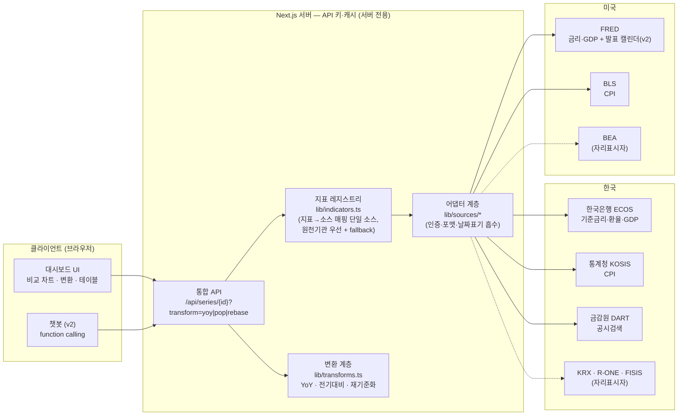

# 아키텍처

## 원칙

- **순수 소비자**: 계산·추정 로직 없음. 나우캐스팅 결과가 필요하면 기존 엔진(GDP/CPI) API만 호출.
- **키는 서버에서만**: 모든 기관 키는 환경변수 → 어댑터. 클라이언트에는 절대 미노출.
- **캐싱**: 어댑터의 외부 fetch에 revalidate 10분 — 기관 호출 한도 보호.
- **UI**: AI OS 민트 팔레트(#147b6d 계열)로 통일. 차트 시리즈 색은 색약 검증 팔레트 별도 사용.
